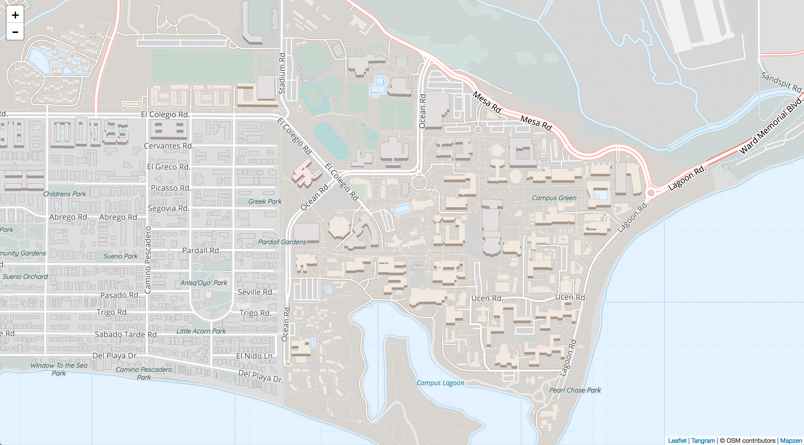
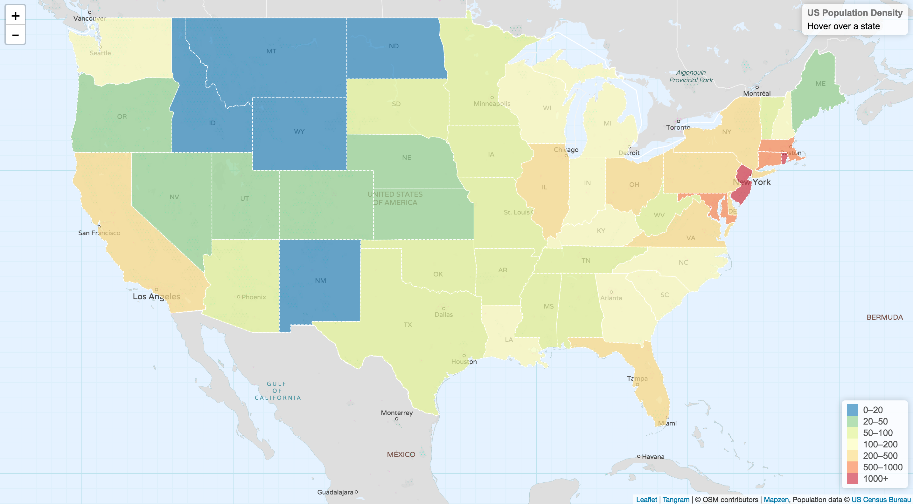

# Web Map Tutorial
This is a [brief tutorial](./A_Brief_Introduction_to_Web_Mapping.pdf "presentation") for web mapping using [Leaflet](http://leafletjs.com/ "Leaflet") and [Tangram](https://mapzen.com/products/tangram/ "Tangram") APIs presented on May 11th, 2017 during the weekly meeting of the [Geography Club at UCSB](https://www.facebook.com/groups/112489222159888 "geography club"). The purpose of this tutorial is to introduce the state-of-the-art web mapping technologies to students who are unfamiliar with web mapping. The tutorial assumes no prior knowledge in coding and programming.
## Preliminary
Since we are only dealing with client side in this case, we will need to prepare our HTML page, CSS and JavaScript code. HTML, which stands for Hypertext Markup Language, is a standard markup language for creating webpages which show texts, forms, images and some interactive elements. JavaScript is a scripting language which is usually used in addition to HTML to change the behavior and content of the webpages. CSS is used to define the style and layout of the webpages.
## Basemap
### Setting Up
First, let's create a default HTML page to show our webmap. Create an empty file using your favorate text editor and name it "index.html". You can copy the content below into your "index.html" or you can download the file [here](Basemap/index.html "index.html").
```html
<!DOCTYPE html>
<html lang="en">
  <head>
    <title>US Population Density Map</title>
    <meta charset="utf-8"/>
    <meta name="viewport" content="width=device-width, initial-scale=1.0">
    <link rel="stylesheet" href="https://unpkg.com/leaflet@1.0.3/dist/leaflet.css" integrity="sha512-07I2e+7D8p6he1SIM+1twR5TIrhUQn9+I6yjqD53JQjFiMf8EtC93ty0/5vJTZGF8aAocvHYNEDJajGdNx1IsQ==" crossorigin=""/>
    <script src="https://unpkg.com/leaflet@1.0.3/dist/leaflet.js" integrity="sha512-A7vV8IFfih/D732iSSKi20u/ooOfj/AGehOKq0f4vLT1Zr2Y+RX7C+w8A1gaSasGtRUZpF/NZgzSAu4/Gc41Lg==" crossorigin=""></script>
    <script src="https://mapzen.com/tangram/tangram.min.js"></script>
    <style>
      #mapid {
        height: 100%;
        width: 100%;
        position: absolute;
      }
      html,body{margin: 0; padding: 0;}
    </style>
  </head>
  <body>
    <div id="mapid"></div>
    <script src="map.js"></script>
  </body>
</html>
```
There are a lot of information in this code. 
```html
<link rel="stylesheet" href="https://unpkg.com/leaflet@1.0.3/dist/leaflet.css" integrity="sha512-07I2e+7D8p6he1SIM+1twR5TIrhUQn9+I6yjqD53JQjFiMf8EtC93ty0/5vJTZGF8aAocvHYNEDJajGdNx1IsQ==" crossorigin=""/>
``` 
tells the page to include the style sheet defined in the Leaflet library so that the map styles and components can be displayed correctly. 
```html
<script src="https://unpkg.com/leaflet@1.0.3/dist/leaflet.js" integrity="sha512-A7vV8IFfih/D732iSSKi20u/ooOfj/AGehOKq0f4vLT1Zr2Y+RX7C+w8A1gaSasGtRUZpF/NZgzSAu4/Gc41Lg==" crossorigin=""></script>
``` 
tells the page to include the Leaflet JavaScript file so that we can use the methods provided by the library in our JavaScript code.
```html
<script src="https://mapzen.com/tangram/tangram.min.js"></script>
```
tells the page to include [Tangram](https://mapzen.com/documentation/tangram/ "Tangram") JavaScript API. This API differs from the Leaflet API in that it will render 2D or 3D maps from vector files. It can also access various predefined [basemap styles](https://mapzen.com/documentation/cartography/styles/ "styles") provided by [Mapzen](https://mapzen.com/ "Mapzen"). You will also be able to [customize your map styles](https://mapzen.com/documentation/tangram/walkthrough/ "Tangram") and use the customized basemap.
```html
<style>
  #mapid {
    height: 100%;
    width: 100%;
    position: absolute;
  }
  html,body{margin: 0; padding: 0;}
</style>
```
defines the styles for this html page. The map content will be displayed on the whole page and there will be no margin and no padding on the page.
```html
<body>
  <div id="mapid"></div>
  <script src="map.js"></script>
</body>
```
tells the page that "mapid" is the id for the map content and the html page will look for the "map.js" javascript file. This is the file that we will be editing to do all the web mapping magic.
### Choosing Basemap
You can download the simplistic example JavaScript file [here](basemap/map.js "example"). Notice that you will need to use your own API key from [Mapzen](https://mapzen.com/dashboard "API key"). You will also need to choose a [basemap style](https://mapzen.com/documentation/cartography/styles/ "styles") and change the value for `scene` like:
```javascript
var layerBubbleStyle = Tangram.leafletLayer({
    scene: "https://mapzen.com/carto/tron-style/tron-style.zip",
    attribution: '<a href="https://mapzen.com/tangram" target="_blank">Tangram</a> | &copy; OSM contributors | <a href="https://mapzen.com/" target="_blank">Mapzen</a>'
});
```
Let's also set the map view to UCSB and set the zoom level to 16:
```javascrip
map.setView([34.4140, -119.8489], 16);
```
Now you should be able to see your web map.

Try to play around with different basemap styles, set map to different default view location and zoom level.
## Choropleth Map
### Setting Up
Let's first download the template HTML ([here](ChoroplethMap/index.html "index.html")) and JavaScript file ([here](ChoroplethMap/map.js "javascript")). Notice that the HTML file has two more lines:
```html
.info { padding: 6px 8px; font: 14px/16px Arial, Helvetica, sans-serif; background: white; background: rgba(255,255,255,0.8); box-shadow: 0 0 15px rgba(0,0,0,0.2); border-radius: 5px; } .info h4 { margin: 0 0 5px; color: #777; }
.legend { text-align: left; line-height: 18px; color: #555; } .legend i { width: 18px; height: 18px; float: left; margin-right: 8px; opacity: 0.7; }
```
These are the styles we define for the `info` and `legend` of our choropleth map.
### Data Processing & Classification
The data we have is in shapefile format ([here](data "data")) and it has population density information for each state in US. In order to make a choropleth map for the population density, we need to classify the values into several groups. You can use any tools (QGIS, ArcGIS, etc.) to do it. For example, the values could be classified into 7 groups:
```
0-20, 20-50, 50-100, 100-200, 200-500, 500-1000, 1000+
```
Let's use the [ColorBrewer](http://colorbrewer2.org/ "colorbrewer") to decide our color scheme for the classification. Since it's quantitative data, we can use `sequential` or `diverging` schemes. Here I use 7-class `diverging` schemes.
```
0-20, #3288bd
20-50, #99d594
50-100, #e6f598
100-200, #ffffbf
200-500, #fee08b
500-1000, #fc8d59
1000+, #d53e4f
```
Now we have our classification and color scheme, we need to load our data on our web map. We know that it works by adding a new layer onto our basemap we just created. An intuitive way to do it is that we can add our shapefile as a layer on the map. This can be done using the `leaflet.shapefile` [plugin](https://github.com/calvinmetcalf/leaflet.shapefile 'leaflet.shapefile'). However, we are going to do it differently. We will use the native support for `geojson` files in Leaflet. `GeoJSON` is a format for encoding geographic data based on `JSON`. It is a very popular data format for many applications including web maps because it's portable and human-readable. There are many tools to convert shapefiles into GeoJSON files. For example in QGIS you can easily save a layer into a GeoJSON file.

However, Leaflet does not parse GeoJSON files directly, it has to be a JavaScript object. Although we can use libraries such as [jQuery](https://jquery.com/ "jquery") to read json files, we won't go that far in this tutorial. An easy trick for Leaflet to read our data is to modify our GeoJSON file into a JavaScript file with just one JavaScript object. This can be done by declaring the json string as an object:
```javascript
var populationData = {
  "type": "Feature",
  "geometry": {
    "type": "Point",
    "coordinates": ...
  },
  "properties": {
    "name": ...
  }
}
```
Then we can rename the file into `population.js`. Just like before, we need to let the HTML file know where to get the object we just created. We can add one line to replace the `//To do` comment:
```html
<script type="text/javascript" src="population.js"></script>
```
### Interactive Choropleth Map
Now let's modify the JavaScript fle to make an interactive choropleth map. We need to tell the script our color schemes. This is done using the `getColor(d)` function.
```javascript
function getColor(d) {
  return d > 1000 ? "#800026" :
         d > 500  ? "#BD0026" :
         d > 200  ? "#E31A1C" :
         d > 100  ? "#FC4E2A" :
         d > 50   ? "#FD8D3C" :
         d > 20   ? "#FEB24C" :
         d > 10   ? "#FED976" :
                    "#FFEDA0";
}
```
This nested `if else` clause simply tells the script what color to use for different values.

Then we need to apply this style using `style(feature)` function. Recall that the density information is in the `density` field of our shapefile.
```javascript
function style(feature) {
  return {
    weight: 1,
    opacity: 1,
    color: "white",
    dashArray: "3",
    fillOpacity: 0.7,
    fillColor: getColor(feature.properties.density)
  };
}
```
You can also change other parameters such as `weight`, `opacity` to change the styles for our choropleth map. 

Next, we need to load our data. `L.geoJson` helps us to do it. We just need to make sure that the object name matches the object name in `population.js`.
```javascript
geojson = L.geoJson(populationData, {
  style: style,
  onEachFeature: onEachFeature
}).addTo(map);
```
As you can see, `style: style,` shows that we apply the styles we previously defined to the `populationData` which is the popultion density data for each state. Each feature is a state, so essentially the `style` we defined previously will be reflected on the state geometry.

Now let's add our `legend`. We need to make sure that our legend matches the classification in the `grades` array.
```javascript
legend.onAdd = function (map) {

  var div = L.DomUtil.create("div", "info legend"),
    grades = [0, 20, 50, 100, 200, 500, 1000],
    labels = [],
    from, to;

  for (var i = 0; i < grades.length; i++) {
    from = grades[i];
    to = grades[i + 1];

    labels.push(
      "<i style='background:" + getColor(from + 1) + "'></i> " +
      from + (to ? "&ndash;" + to : "+"));
  }

  div.innerHTML = labels.join("<br>");
  return div;
};
```
Voilà! We just made our first interactive choropleth map! You can customize the visualizations if you want.

## Attribution
Some material in this tutorial is adapted from [Leaflet tutorial](http://leafletjs.com/examples.html "leaflet tutorial") and [Tangram repo](https://github.com/tangrams/tangram "tangram"). The data is based on the shape provided by [Mike Bostock](https://bost.ocks.org/mike/ "Mike") and population statistics provided by [US Census Bureau](http://www.census.gov/ "US Census Bureau").
